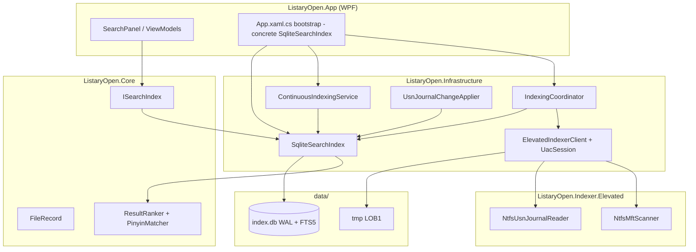
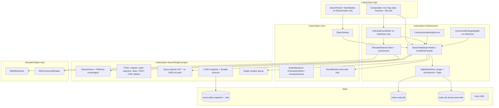
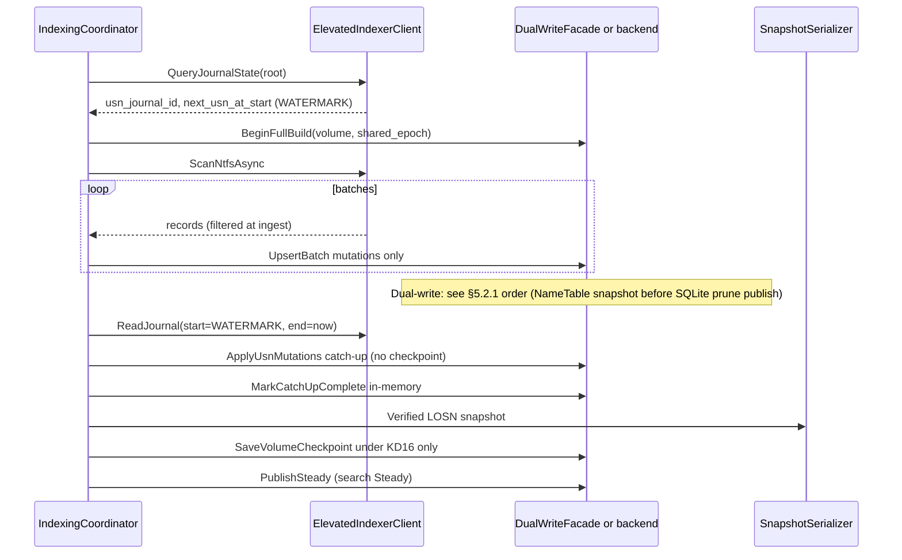

# Design: Everything-Style In-Memory Index + Search for ListaryOpen

**Status:** Revised after multi-agent review (v3)  
**Date:** 2026-08-08  
**Author:** design-doc-writer  
**Scope:** Indexing + search architecture redesign  
**Repo:** `C:\Users\paulx\OneDrive\projects\listary_open`  
**Review addressed:** `grok-design-review-75806cc7.md` (round 1: 48; round 2: 9 dual-write protocol gaps)

---

## 1. Context & goals / non-goals

### 1.1 Product context

ListaryOpen is a Windows-first launcher/search product. Search quality and latency are first-class. Indexing must use NTFS MFT + USN Journal when elevated access is available, with a single sticky UAC session for the app lifetime.

### 1.2 Current architecture (summary)

| Layer | Location | Role today |
|---|---|---|
| UI / VM | `src/ListaryOpen.App` (`SearchPanelViewModel`, `App.xaml.cs`) | Consumes `ISearchIndex`; starts indexing |
| Search API | `src/ListaryOpen.Core/Search/ISearchIndex.cs` | `SearchAsync`, `UpsertAsync`, `DeleteAsync`, `RecordUsageAsync`, `GetRecentAsync` |
| Record model | `src/ListaryOpen.Core/Indexing/FileRecord.cs` | Path, name, parent, size, mtime, FRN |
| Ranking | `ResultRanker`, `PinyinMatcher`, `FuzzyMatcher`, `PathSegmentMatcher` | Candidate re-rank after SQL fetch |
| SQLite index | `src/ListaryOpen.Infrastructure/Search/SqliteSearchIndex.cs` | `files` + FTS5 trigram + `usage` + `volume_checkpoints` + generation recon |
| Coordinator | `IndexingCoordinator` (hard-typed to `SqliteSearchIndex` today) | Full scan, bulk/generation/prune, checkpoint read/write, USN catch-up |
| Continuous | `ContinuousIndexingService` | `FileSystemWatcher` hints → live upsert/delete |
| USN apply | `UsnJournalChangeApplier` + `SqliteSearchIndex.ApplyUsnJournalChangesAsync` | Journal deltas + hard-link resync **in one SQLite transaction with checkpoint** |
| Elevated helper | `ListaryOpen.Indexer.Elevated` | MFT (`NtfsMftScanner`), USN (`NtfsUsnJournalReader`), sticky pipe worker |
| Client | `ElevatedIndexerClient` + `ElevatedIndexerUacSession` | Serial command gate; `scan-to-file` / journal commands |
| Transport | `ElevatedIndexerBinaryCodec` (`LOB1` frames) | Full-path frames today |

Observed scale from production artifacts/docs:

- ~0.9M–2.5M+ rows on developer machines  
- SQLite + FTS footprint multi-GB **on disk**; process RSS after warm search is a separate measurement (see Appendix D)  
- Warm SQLite search after FTS warmup: 5–16 ms on ~1.5M rows for some queries (manual checklist) — strong baseline NameTable must beat  

### 1.3 Everything reference model (voidtools) — required vs aspirational

| # | Reference behavior | v1 required? | Notes |
|---|---|---|---|
| 1 | First index: read NTFS MFT | **Yes** | Keep elevated helper |
| 2 | Steady state: USN Journal deltas | **Yes** | Pre-scan watermark + post-scan catch-up (§5.2–5.3) |
| 3 | Runtime in-memory name table (UTF-8 names, size, mtime, parent pointers) | **Yes** | Core of this design |
| 4 | Secondary indexes: name, path, size, date | **Yes** (name+path+date in v1; size index optional) | Path segment index in v1 for parity (§6.2) |
| 5 | Search compiled to bytecode | **Aspirational** (phase 2+) | v1: allocation-free AST planner (§6.8) |
| 6 | Serialize DB on exit; restore then resume USN | **Yes** | With durable checkpoint invariant (§4.3) |
| 7 | Not SQLite/FTS5; specialized name table | **Yes** for file rows | Residual SQLite for usage/meta only |

### 1.4 Goals (honest, measurable)

| ID | Goal | Success metric (gateable) |
|---|---|---|
| **G1** | **Warm name search faster than SQLite FTS path** on the same machine/corpus/query set | On Appendix D harness (T0 fully resident): NameTable p95 ≤ **0.7×** SQLite p95 for golden name-prefix/substring set at **1M and 5M**; absolute p50/p95 reported (targets guide: p50 ≤ 15 ms, p95 ≤ 40 ms at 5M for 3–12 char name queries, top-50 — **not** claimed as Everything C parity). **G1 alone is not enough for cutover** — must also pass **G11 ablation** |
| **G1-short** | Short queries bounded | 1–2 char queries: p95 ≤ 80 ms **or** early-exit when candidates > `MaxShortQueryCandidates` (default 20_000) with partial results + UI hint |
| **G11** | **Mandatory ablation: prove the new architecture is a large win** before defaulting NameTable | Published dual-run ablation report (Appendix D §D.2) on same machine/corpus/query JSON: (1) **semantic equivalence** green; (2) warm search geometric-mean p50 speedup **≥ 2.0×** vs SQLite on full golden set @ 1M and 5M; (3) FTS/substring-heavy slice geometric-mean p50 **≥ 3.0×**; (4) component ablations show which pieces buy the win (name-table vs residual SQLite usage path, prefix index, trigram, dual-write tax). **Fail-closed:** if G11 fails, **no PR8a**, no “architecture success” claim, and either iterate engine or stop the migration |
| **G2** | Journal-after-MFT apply without FTS tax | ≤ **5 ms** p95 for ≤32 USN changes; ≤ **50 ms** p95 for ≤1_000 changes (create/delete/rename-file/hardlink; **excludes** directory rename until v2 pointer rewrite) |
| **G2-build** | First-load throughput | ≥ **80k records/s** median LOB1→arena apply (decode+upsert, single volume) on Appendix D machine class; peak RSS during full build ≤ **2.5×** steady post-build RSS |
| **G3** | Single sticky UAC session retained | Same UX as today (`ElevatedIndexerUacSession`) |
| **G4** | Product capability parity | Dual-read T1/T2/T3 gates (§8.2, Appendix C); pinyin in golden set |
| **G5** | Incremental migration with **lossless SQLite rollback during dual-write window only** | Flag state machine (§8.1); post-cutover rollback is MFT rescan or reverse-tool (not “no reinstall magic”) |
| **G6** | Document SQLite residual surface | §8.5 single SoT per concern |
| **G7** | Multi-million-file RAM plan | Measured RSS gates before cutover; dual-run envelope (§9) |
| **G8** | No permanent Windows service required | Optional service only, future |
| **G9** | Cold start from snapshot | TTF (time-to-first-search, possibly degraded) ≤ **2 s** @ 5M; `SearchSteady` (catch-up done + indexes ready) ≤ **15 s** @ 5M on Appendix D class |
| **G10** | Durability | Never resume USN past durable NameTable image; crash matrix green (Appendix C) |

**Cutover rule (G11):** The NameTable architecture is only considered a success if ablation proves a **large** improvement under controlled A/B. Relative “a bit faster” (G1 alone) may keep the work as experimental; **shipping default search on NameTable requires G11**.

### 1.5 Non-goals

- Rewriting the WPF ViewModels/preview host/shell hooks (bootstrap **is** in scope)  
- Matching Everything’s full advanced query language / macros in v1  
- **Everything native C engine latency/RAM parity** as a v1 gate (tracked as aspirational gap table in Appendix D)  
- Content (file-body) indexing  
- Replacing the elevated MFT/USN helper in v1  
- Multi-OS indexing  
- Permanent always-on Windows service as default  
- Dual-write as a long-term low-RAM production configuration  

---

## 2. Current vs target architecture

### 2.1 Current architecture



### 2.2 Target architecture



### 2.3 Responsibility split

| Concern | Owner |
|---|---|
| MFT/USN raw IO | Elevated helper (serial `_commandGate`) |
| LOB1 transport | Codec; **parent-FRN+name extension scheduled before G2-build claims** (§5.1) |
| Name table + indexes | `ListaryOpen.SearchEngine` (no `Sqlite*` references; architecture test) |
| Query selection | NameTable (IDs + cheap fields + match **hints**) |
| Final ranking | Core `ResultRanker` on **bounded** materialized `FileRecord` set |
| Usage / recents | Residual SQLite meta + NameTable path resolve after cutover |
| Checkpoints | **Single SoT protocol** (§4.3, KD16) |
| WPF ViewModels | Unchanged vs `ISearchIndex` |
| App composition | **In-scope** for PR5–PR6 |

---

## 3. In-memory data model

### 3.1 Design principles

1. One record per indexed path instance (hard link = separate name entry; FRN multimap).  
2. Parent pointers + name heap; **no full paths in hot table**.  
3. Stable `RecordId` with explicit tombstone + compact policy.  
4. Per-volume arenas.  
5. UTF-8 names; **precomputed case-folded key at index time** (no per-query `ToUpperInvariant` allocs).  
6. **Filter-at-ingest** matches today’s SQLite inclusion set during dual-write (§3.5).  

### 3.2 Core types

```text
VolumeId       : u16
RecordId       : u32   // 0 = invalid; monotonic alloc + free-list; compact remaps
Frn            : u64
NameOffset     : u32
NameLength     : u16
Flags          : u8    // Directory, Tombstone, ...
```

```csharp
[StructLayout(LayoutKind.Sequential, Pack = 1)]
struct FileEntry {
  uint parent_id;
  uint name_off;
  ushort name_len;
  byte flags;
  byte pad0;
  ulong size_bytes;
  long mtime_utc_ticks; // DateTimeOffset.UtcTicks for parity; width accepted cost
  ulong frn;
}
// sizeof == 36 with Pack=1; enforce via static assert in unit tests
```

**Storage (v1 default — unmanaged arenas):**

```text
VolumeArena (NativeMemory / AlignedAlloc):
  entries: FileEntry*          // contiguous
  name_heap: byte*             // UTF-8 names
  fold_heap: byte*             // precomputed case-folded UTF-8 keys (or offset into shared)
  name_order: u32*             // RecordId perm sorted by fold key (bulk) + delta overlay
  children_csr: (offsets u32*, child_ids u32*)  // CSR adjacency
  frn_map: open-address hash in arena or compact multimap (not Dictionary per entry)
  path_key_map: open-address hash64 → RecordId (+ collision chain)  // MANDATORY reverse index
  trigram_postings: delta-varint blocks in arena
  alias_postings: same encoding
  path_segment_postings: token → posting (v1 required for path: parity)
  live_set: BitArray over RecordId capacity (mandatory for in-place reconcile)
  tombstone_count / capacity   // for forced compact policy
```

**Managed heap avoided for:** `FileEntry[]`, posting bodies, name heaps, path_key_map bodies.  
**Managed OK for:** top-K result lists, mutator queue messages, small usage side map.

#### path_key → RecordId reverse index (mandatory)

```text
Structure (arena open-address):
  slot: { path_key_hash: u64, record_id: u32, next_collision: u32 }
  hash = XXH3_64( path_key UTF-16/UTF-8 bytes as produced by existing PathKey helper )
  Lookup:
    1. h = hash(path_key)
    2. probe open-address / chain
    3. on hash hit: materialize full_path(record_id), compute PathKey, compare exact
       (collision verify — rare materialize only on hash hit)
    4. miss → no live entry

Update on upsert/delete/rename/HardLinkResync:
  - remove old path_key slot(s) for affected RecordIds
  - insert new path_key after path known (from LOB2 name+parent walk or full path DTO)
  - same path_key → same RecordId (in-place replace metadata)

Budget: ~20 B/entry average (hash+id+chain load factor ~0.7) → ~20 MB @ 1M, ~100 MB @ 5M
NOT storing full uppercased path strings in the map (parent-pointer model preserved).

USN path: prefer FRN multimap for FRN-keyed ops; still maintain path_key_map for
  path deletes, watcher, GetRecent, dual-write path_key parity.
Watcher/usage: always path_key_map.
Golden tests: PathKey equality vs SQLite for NTFS-emitted paths; upsert-same-path keeps RecordId.
```

**Path materialization:**

```text
full_path(volume, id) -> walk parents, reverse-join '\'
cache: LRU RecordId→string tagged with arena_generation; invalidate on parent/name change
cap: MaxPathMaterializationsPerQuery = 2 × query.Limit  (default 100) for rank path;
     path: queries use segment index first, then materialize only survivors
```

### 3.3 Identity & hard links

| Concept | Rule |
|---|---|
| Primary key | `(VolumeId, RecordId)` |
| Path identity | Reconstructed path → `PathKey = upper-invariant of normalized full path` **exactly** matching existing `FileRecord.PathKey` / SQLite |
| Upsert same path | **In-place replace** via `path_key_map` hit; never allocate duplicate live RecordId for same path_key |
| FRN multimap | FRN → list of live RecordIds |
| HardLinkResync | **Single atomic mutator transaction:** remove all old RecordIds for FRN from every secondary index + children + name_order/delta + path_key_map; insert new set; rebuild affected postings for those IDs only |
| Tombstones | Flag bit; **invisible to search**; freed on compact |
| RecordId reuse | Free-list after compact only; until then monotonic. Stale IDs never appear in committed epoch indexes |

**Tombstone compact policy (global):**

```text
tombstone_ratio = tombstone_count / max(live_count + tombstone_count, 1)
When tombstone_ratio > 0.15 OR free_list fragmented beyond threshold:
  1. Mutator thread runs compact: rewrite arena, remap RecordIds, rebuild secondary indexes
  2. Dual-write mode: only when BOTH backends are quiescent for this volume
     (no in-flight USN/bulk batch; Diverged volumes must rebuild instead of compact-only)
  3. After compact: optional LOSN snapshot if catch_up_complete and memory watermarks
     unchanged relative to last durable (or include new durable_next_usn if dirty)
  4. Snapshot not required for search correctness (compact is in-memory epoch publish)
```

**Dual-write hard-link order:** façade applies identical logical ops to both backends in one batch; never interleave path-delete on one side with FRN-resync on the other mid-batch.

**Watcher vs USN:** both enter the **same mutator queue**. When USN journal is healthy, watcher applies are coalesced and may be suppressed if USN lag < threshold (prefer USN-only). Identity is always path_key for path ops.

### 3.4 Secondary indexes

#### 3.4.1 Name prefix (v1 definitive)

- At index time: store folded UTF-8 key (Windows-compatible fold for v1: same as `ToUpperInvariant` on decoded name, **encoded once** into `fold_heap`).  
- Bulk: sorted `name_order` by fold key (byte-wise compare on folded UTF-8).  
- Range: proper next-prefix bound via byte arithmetic on folded key (not `\uFFFF` hack).  
- **Live updates:** immutable sorted snapshot + **sorted delta map** (`BTree`/`SortedList` of fold→id, max size S); when `|delta| > CompactThreshold` (default 50_000) or on bulk end, merge into new `name_order` epoch.  
- Complexity: prefix lookup O(log N + K); live insert O(log S); compact O(N).  
- PascalCase→snake/kebab **query** variants: only when query token has mixed case / camel pattern; each variant is an extra binary search (≤4 probes). Precomputed folded **stored** name is single key.  
- G1 includes multi-probe cost for camel queries in golden set.

#### 3.4.2 Substring / trigram (v1 definitive — no full-heap scan on G1 path)

- 3-byte overlapping grams over **folded name bytes** (and over alias strings when present).  
- Postings: sorted `RecordId` lists, **delta-varint** encoded blocks (~1–3 B/id average after delta).  
- Query: for term length ≥ 3, take rarest gram, intersect (galloping / two-pointer).  
- Terms length 1–2: **no full corpus scan** — use prefix bucket expansion with hard cap `MaxShortQueryCandidates`, else degrade.  
- **Banned as G1 path:** SIMD full name-heap scan.  
- **Live updates:** append-only tombstone bit in postings + side delete set; rebuild postings for touched grams on compact / bulk end. Single-id insert updates ≤ name_len gram lists (amortized).  
- Memory model: ~25–45 B/entry average ASCII; CJK higher (UTF-8 multi-byte grams). Formula: `postings_bytes ≈ avg_grams_per_name * avg_posting_bytes * N`. Prototype must measure before cutover.  
- **Cold start (OQ2 resolved):** store **compressed trigram postings in snapshot** if rebuild would miss G9; otherwise rebuild only if measured rebuild @ 5M ≤ 8 s on Appendix D. Default design: **store postings** in snapshot for G9; optional rebuild-only flag for smaller disk demos.

#### 3.4.3 Path segment index (v1 required)

- Tokenize parent path segments at ingest (from path parse or parent walk).  
- Posting lists per lowercased segment token.  
- Supports `path:` and multi-segment `a\b` without materializing all candidates.  
- RAM: budget ~8–15 B/entry average; measure.

#### 3.4.4 Children CSR

```text
offsets[entry_count+1], child_ids[edge_count]
```

- Bulk rebuild after MFT.  
- Live: patch lists in arena freelist or rebuild children CSR on compact.  
- Used for `DeletePathAndDescendants` and v2 directory rename.

#### 3.4.5 FRN, size, date

- FRN: arena open-address multimap.  
- Date: optional sorted id by mtime for date chips (or filter during candidate walk if K small).  
- Size index: phase 2 unless UI requires.

#### 3.4.6 Alias / pinyin postings

See §6.4 and §9.1 for cardinality budget.

### 3.5 Volume roots, subtree roots, **filter-at-ingest**

- NTFS provider still **enumerates full volume MFT** (elevated).  
- **Inclusion filter runs at ingest** (same predicates as coordinator / `ConfiguredIndexFilter` / exclusions today) before upsert into NameTable **and** SQLite.  
- NameTable does **not** store whole-volume then filter-at-query during dual-write — dual-read inclusion sets must match.  
- **G7 implication:** under NTFS provider, scan work scales with volume MFT size; **indexed RAM scales with included entry count** after filter. Document both in UI warnings.  
- Synthetic root entry per volume for path walks of included trees.

### 3.6 Generation / reconciliation

```text
full_scan_token : u64  // maps 1:1 to SQLite index_generation during dual-write (shared epoch from façade)
live_set        : mandatory bitset for in-place reconcile
```

**v1 full build:** prefer **atomic cold arena swap** (new arena built, pointer swap, old freed).  
**In-place reconcile:** only with live_set mandatory; prune = clear non-live under root.  
**Abort-bulk:** discard building arena; leave previous epoch; do not advance checkpoint or generation.  
**Partial multi-root failure:** same as today (`retainedStaleRecords`); dual-write applies identical prune skip on both.

Peak RAM during rebuild: **budget 2× steady arena** until old freed.

### 3.7 Concurrent access (single design, not alternatives)

| Role | Rule |
|---|---|
| **All NameTable mutations** | **One mutator queue / thread** (USN, watcher, bulk commits, compact, re-alias, snapshot freeze requests) |
| Readers | Read `committed_epoch` pointer only (immutable snapshot of arrays + indexes for that epoch) |
| Epoch publish | Pointer swap after mutator commits; no torn reads |
| Snapshot | Prefer COW-friendly: mutator pauses publishes ≤ **20 ms** search-visible stall budget; long serialize copies committed epoch buffers off-thread |
| Dual-write | Same mutator façade sequences SQLite apply + NameTable apply; readers of DualRead use version-tagged pair |
| DualRead compare | Prefer quiesced or same `full_scan_token` + same applied USN watermark |

---

## 4. Persistence format & durability

### 4.1 Files under `data/`

| Path | Phase | Purpose |
|---|---|---|
| `data/index.db` | dual-write | Full SQLite (files+FTS+usage+checkpoints+flags) — **control plane** |
| `data/name-table.snapshot` | NameTable on | Primary image |
| `data/name-table.snapshot.bak` | NameTable on | Last known-good |
| `data/name-table.snapshot.tmp` | write | Incomplete write |
| `data/index-meta.db` | **from PR5 onward** separate file | usage + checkpoints + flags + schema after split; during dual-write may still live inside `index.db` until cutover copy |
| `data/tmp/` | always | Elevated LOB1 |

**Prefer separate `index-meta.db` early** (PR5) even if dual-write still uses `index.db` for files — flags and kill-switch must not live only in a DB that cutover deletes.

`AppDataPaths` gains: `NameTableSnapshotPath`, `NameTableSnapshotBackupPath`, `IndexMetaDatabasePath`.

**Single-writer file lock:** open exclusive lock file `data/listaryopen.lock` at bootstrap; refuse second process on same profile.

### 4.2 Snapshot format (`LOSN`)

```text
Header (header_size field, min 256):
  magic 'LOSN'
  format_version u16     // wire format
  header_size u16
  flags u32              // bit0 compressed_lz4, bit1 has_trigram_section, ...
  volume_count u16
  created_utc_ticks i64
  content_version u64    // pinyin/alias rules
  rules_version i64      // exclusion rules
  checksum_domain u8     // 0 = uncompressed logical payload
  checksum_xxh3 u64
  payload_length u64
  global_generation u64  // snapshot commit gen
  per-volume section table with offsets + per-volume xxh3

Per-volume:
  volume_root_utf8
  usn_journal_id u64
  durable_next_usn i64   // watermark COMMITTED with this image (KD16)
  entry_count, heap sizes
  entries[], name_heap[], fold_heap[]
  name_order[]
  children CSR
  frn multimap serialization
  trigram postings (default ON for G9)
  alias postings
  path_segment postings
  live_set optional bitset
  catch_up_complete u8   // 0 = degraded image; auto-snapshot forbidden if 0
```

#### Compatibility policy

- Readers accept `format_version ≤ MaxKnown`.  
- Higher version or **unknown required flag** → refuse load + schedule MFT rebuild (fail closed).  
- Optional sections: size-prefixed; skip unknown optional.  
- **No silent reinterpret** of packed entries across breaking versions; provide upgrader or rebuild.  
- Separate versioning: `format_version` (LOSN), `content_version` (aliases), `index-meta.db user_version` (SQLite schema).  
- Checksum: **always over uncompressed logical payload** (decompress then hash if flag set).

#### Load mode

- **v1:** verify checksum (hierarchical: per-volume then global; sampling only if measured full hash > 500 ms @ 5M — prefer full), **memcpy into unmanaged arena**, rebuild only structures not stored.  
- True search-in-mmap without copy is **not** v1 (avoids relocatable pointer complexity).  
- Expected snapshot size (stored postings, uncompressed guide): ~80–150 MB @ 1M; ~400–750 MB @ 5M — **measure**.

### 4.3 Durability invariant (KD16) — **mandatory**

**Hard rule:** Never advance a durable USN resume watermark past the NameTable content that is durable on disk.

#### Sources of truth

| Artifact | Role |
|---|---|
| **In-memory `memory_next_usn` + `usn_journal_id`** | Applied but not necessarily durable |
| **Snapshot per-volume `durable_next_usn` + `usn_journal_id`** | Cold image watermark — **commit-coupled** to that image’s entries |
| **`volume_checkpoints` in SQLite** | Hot durable resume pointer — **must never exceed** `durable_next_usn` on last verified snapshot (and under dual-write, never exceed min of both sinks’ applied-and-durable state) |

#### Mutation vs checkpoint split (KD21) — **mandatory for dual-write / NameTable**

Today `SqliteSearchIndex.ApplyUsnJournalChangesAsync` commits **file mutations + `volume_checkpoints` in one transaction**. That combined path **must not** be used by DualWriteFacade or NameTable-mode durability.

| API | Writes files/rows? | Writes `volume_checkpoints`? | Who calls |
|---|---|---|---|
| `ApplyUsnMutationsAsync(changes, epoch)` | Yes | **No** | DualWriteFacade / NameTable mutator; SQLite dual-write path |
| `ApplyBulkMutations…` / prune with `publishGeneration: false` | Yes | **No** until durability layer says so | DualWrite full build |
| `SaveVolumeCheckpointAsync(checkpoint)` | No | Yes | **Only** durability owner (§5.6.1) under KD16 |
| Legacy `ApplyUsnJournalChangesAsync(changes, checkpoint)` | Yes | Yes | **SQLite-only mode only** (preserves current tests) |

**Dual-write USN batch (normative):**

```text
1. DualWriteFacade receives batch + proposed next_usn / journal id (hint only).
2. SQLite.ApplyUsnMutationsAsync(batch)  // commit files rows; assert checkpoint row UNCHANGED
3. NameTable.ApplyUsnMutationsAsync(batch)  // in-memory; update memory_next_usn
4. If either step fails → §8.2.1 Diverged algorithm (no SaveVolumeCheckpoint).
5. Both ok: update façade memory watermarks; schedule/force snapshot per lag policy.
6. Only after verified LOSN snapshot includes this volume’s durable_next_usn ≥ target:
     durability layer SaveVolumeCheckpoint(min watermarks) once.
```

**PR1 acceptance:** SQLite exposes mutation-only USN apply; unit test: after dual-write-style apply, `volume_checkpoints.next_usn` equals pre-batch value.  
**Appendix C22:** dual-write USN batch success → SQLite checkpoint still pre-batch until verified snapshot completes.

#### Resume algorithm on load

```text
1. Load snapshot S if valid else empty.
2. Read meta checkpoint M for volume.
3. If S missing: full MFT (pre-scan watermark protocol).
4. If journal ids differ between S and M: prefer S image; if M journal id matches live journal and S does not → full MFT.
5. resume_usn = min(S.durable_next_usn, M.next_usn) with matching journal id;
   if only one side has matching journal id, use that side’s usn but never above S.durable_next_usn when S is loaded.
6. Dual-write startup: also compare SQLite files_generation / full_scan_token vs S;
   if mismatch → §5.2.1 full-build reconciliation (C21) — do not dual-read green.
7. Re-apply USN from resume_usn → current before SearchSteady.
8. After catch-up complete: may write new snapshot then advance M under protocol below.
```

**Chosen primary strategy:** (A) + (C):  
- Do not advance M past last successful snapshot’s durable watermark.  
- **v1:** advance M only after verified snapshot for that volume includes the watermark (snapshot-before-meta).

#### Dirty policy + journal-wrap / durable lag (KD22)

Track per volume:

```text
memory_next_usn     // last successfully applied in RAM (both sinks under dual-write min of both)
durable_next_usn    // last verified snapshot (+ meta after Save)
durable_lag         // memory_next_usn - durable_next_usn (same journal id)
```

**G2 measures in-memory apply latency only — not durable checkpoint latency.**

| Trigger | Action |
|---|---|
| `catch_up_complete=0` | **Forbidden** auto-snapshot; dual-read not green |
| Dirty && every **2 minutes** wall while `memory_next_usn > durable_next_usn` | Force verified snapshot then SaveVolumeCheckpoint |
| Dirty && **≥ 50_000** applied mutations since last durable | Force snapshot + checkpoint |
| Live journal: bytes/range remaining from `FirstUsn` such that durable watermark is within **danger zone** (journal may wrap past `durable_next_usn` before next debounce) — e.g. free USN range ahead of durable &lt; **10%** of journal max size OR planner reports invalid for durable watermark | **Force snapshot immediately**; if journal already invalid vs **durable** watermark → **full MFT** (explicit; not “re-apply from memory”) |
| `UsnJournalCatchUpPlanner` validity checks | Must evaluate against **durable_next_usn**, not only memory_next_usn, when deciding “can resume vs must MFT” after restart |

Defaults: `SnapshotDebounceMax = 2 min`, `SnapshotMutationThreshold = 50_000`. Implementers may tighten, not loosen without waiver.

#### Crash-safe snapshot write protocol (Windows)

```text
1. Write complete image to name-table.snapshot.tmp
2. Flush file (FlushFileBuffers / FileStream.Flush(true))
3. Flush parent directory (CreateFile on data\ with backup semantics + FlushFileBuffers) best-effort
4. Verify checksum by re-reading tmp (or hashing while writing + length check)
5. If name-table.snapshot exists:
     - Copy/replace to .bak ONLY after tmp is verified
     - Prefer: File.Replace(tmp, snapshot, backupPath, ignoreMetadataErrors:false)
       ensuring backup retains previous good until replace succeeds
6. Never delete last known-good before new verified file is durable
7. Update meta checkpoints (M) to durable watermarks in SQLite transaction
   (ONLY durability owner; never from mutation apply)
8. fsync meta DB (WAL checkpoint TRUNCATE or full pragma) after
```

**Crash matrix (must pass):** tmp write; after tmp before replace; after replace before meta; meta before snapshot (must not leave M ahead — code must order snapshot first); bulk arena mid-swap; dual-write one-side; dual-write USN with mutation-only SQLite (C22); dual-write full MFT SQLite durable pre-NameTable snapshot (C21); kill after checkpoint attempt blocked by invariant.

### 4.4 Content / rules version

Shared type in Core: `IndexContentVersions` (not `SqliteSearchIndex.CurrentIndexContentVersion` static).

Dual-write **barrier** on bump:

1. Both backends enter maintenance (no USN advance).  
2. Same rebuild kind (re-alias / full).  
3. Bump versions together.  
4. Resume USN.  
5. Parity tags expected `content_version`.

---

## 5. Indexing pipeline

### 5.1 Elevated boundary & LOB1

Keep helper + sticky UAC + serial command gate (hard throughput ceiling for multi-volume: sum of volume times).

**LOB1 extension (scheduled before claiming G2-build / first-load SLOs):**

```text
LOB2 frame (or flags in LOB1):
  frn, parent_frn, flags, size, mtime, name_utf8
  // full path optional for debug
```

- **Interim v1 path:** may parse full path for folder intern.  
- **Target ingest:** stream FRN+parent_frn+name into arena **without** per-file managed `FileRecord` (span DTO / stack struct).  
- **Out-of-order MFT:** deferred link queue for children whose parent FRN not yet seen; second pass attaches; never silent orphans (emit metrics if unresolved).

### 5.2 Full MFT first load — pre-scan watermark + catch-up



**Critical:** sample journal **before** multi-minute MFT; after apply, catch up through current; only then Steady. Dual-write shares the **same watermark and epoch**. Journal validity vs **durable** watermark uses KD22.

#### 5.2.1 Dual-write full MFT durability (normative) — rule A + C

SQLite batch upserts are durable in `index.db` as each transaction commits. NameTable is durable only after verified LOSN. Therefore:

**During dual-write full build:**

```text
1. BeginFullBuild both sides with shared_epoch; SQLite bulk may upsert with
   publishGeneration=false / generation not yet authoritative for prune.
2. Stream filtered records:
   a. NameTable building arena: upsert batches (not yet committed epoch for Steady)
   b. SQLite: UpsertMany with epoch token but DO NOT PruneStale / DO NOT write
      volume_checkpoints / DO NOT flip content “generation live” for dual-read green
3. NameTable CommitFullBuild → publish searchable in-memory epoch (SearchDegraded OK)
   BUT durable=false until snapshot.
4. USN catch-up mutations to BOTH via ApplyUsnMutationsAsync only.
5. Verified LOSN snapshot with durable_next_usn + full_scan_token + catch_up_complete=1
6. ONLY THEN SQLite:
   - PruneStaleUnderRoot / publish generation as live control
   - (still no checkpoint until step 7 if catch-up advanced memory_next_usn)
7. SaveVolumeCheckpoint once under KD16 (durability owner)
8. Mark volume Steady; dual-read may go green
```

**If crash between SQLite durable batch upserts and NameTable snapshot:**

- Preferred path if step 2b withheld prune: SQLite has extra generation rows but old generation still queryable → startup C21 forces NameTable MFT rebuild (or both) and does not dual-read green until aligned.
- If implementer mistakenly pruned SQLite early: **startup reconciliation (rule C)** mandatory:

```text
C21 startup:
  sqlite_gen = files_generation / per-volume generation marker
  snap_token = S.full_scan_token for volume
  if DualWrite && (snap missing || snap_token != sqlite_gen || inclusion counts diverge):
    Mark Diverged
    Force NameTable full MFT rebuild for volume (SQLite remains control read)
    Do not advance checkpoint; dual-read not green until rebuild + snapshot + min-ack
```

**NameTable post-CommitFullBuild pre-snapshot:** searchable degraded OK; **not** Steady; **not** dual-read green; crash loses that epoch (rebuild).

**SQLite-only mode:** may keep today’s combined apply+checkpoint and prune-after-scan behavior (existing tests).

### 5.3 USN steady state

Map changes → mutator ops; `DirectoryRenameOrMove` → full volume rescan v1.  
**Never** call combined SQLite apply+checkpoint under DualWrite/NameTable.  
Checkpoint advance only via durability owner under KD16 + §8.2.

### 5.4 Continuous watcher

Hints only; same mutator queue; path_key in-place upsert; prefer USN when healthy. Coalesce windows under antivirus storms; measure 10k events/s synthetic.

### 5.5 Fallback scan

Non-NTFS: path-based FRN=0; FRN multimap unused; USN disabled for that volume.

### 5.6 Complete backend port surface

Today coordinator/applier/bootstrap use more than `ISearchIndex`. **Required interfaces** (Core or Infrastructure, implemented by SQLite, NameTable, DualWrite façade):

```csharp
// Query + usage (existing + clarify GetRecent)
public interface ISearchIndex { /* existing */ }

// Shared epoch / generation
public interface IIndexEpoch {
  Task<long> BeginIndexingRunAsync(CancellationToken ct);
  long? CurrentEpoch { get; }
}

public interface IBulkIndexSession : IIndexEpoch {
  Task BeginBulkAsync(CancellationToken ct);
  Task AbortBulkAsync(CancellationToken ct);          // discard building epoch
  Task EndBulkAsync(CancellationToken ct);
  Task UpsertManyAsync(IEnumerable<FileRecord> records, long epoch, CancellationToken ct);
  /// <summary>publishGeneration: false under dual-write until NameTable snapshot durable (§5.2.1).</summary>
  Task<int> PruneStaleUnderRootAsync(string root, long epoch, CancellationToken ct, bool publishGeneration = true);
}

/// <summary>MUTATIONS ONLY — never writes volume_checkpoints (KD21).</summary>
public interface IUsnMutationSink {
  Task ApplyUsnMutationsAsync(
    IEnumerable<UsnJournalIndexChange> changes,
    CancellationToken ct,
    long indexGeneration = 0);
  // All ops MUST be idempotent for the same logical change (upsert path, delete path, HardLinkResync FRN).
}

/// <summary>
/// SQLite-only compatibility: mutations + checkpoint in one transaction (today’s behavior).
/// DualWriteFacade and NameTable backends MUST NOT implement this as their dual-write path.
/// </summary>
public interface IUsnCombinedApplySqliteOnly {
  Task ApplyUsnJournalChangesAsync(
    IEnumerable<UsnJournalIndexChange> changes,
    UsnJournalCheckpoint checkpoint,
    CancellationToken ct,
    long indexGeneration = 0);
}

public interface ICheckpointStore {
  Task<UsnJournalCheckpoint?> ReadVolumeCheckpointAsync(string volumeRoot, CancellationToken ct);
  /// <summary>See §5.6.1 ownership — not free for coordinator in DualWrite/NameTable modes.</summary>
  Task SaveVolumeCheckpointAsync(UsnJournalCheckpoint checkpoint, CancellationToken ct);
}

public interface IContentVersionProvider {
  long ContentVersion { get; }
  long RulesVersion { get; }
  Task EnsureContentVersionAsync(CancellationToken ct);
}

public interface ILiveIndexChangeSink { /* existing */ }

public interface IIndexBackend :
  ISearchIndex, IBulkIndexSession, IUsnMutationSink,
  ICheckpointStore, IContentVersionProvider, ILiveIndexChangeSink,
  IAsyncDisposable
{
  IndexBackendKind Kind { get; } // SqliteOnly, NameTableOnly, DualWrite
  SearchReadiness Readiness { get; } // Empty, DegradedCatchUp, Diverged, Steady
  VolumeHealth GetVolumeHealth(string volumeRoot);
}
```

**Rule:** `IndexingCoordinator` / `UsnJournalChangeApplier` / continuous service take **`IIndexBackend` only** — zero concrete `SqliteSearchIndex` after PR1.

#### 5.6.1 Checkpoint write ownership matrix (single owner)

| Backend mode | Who may call `SaveVolumeCheckpointAsync` | Who applies USN mutations | Coordinator direct Save? |
|---|---|---|---|
| **SqliteOnly** | Coordinator **or** combined `IUsnCombinedApplySqliteOnly` (pick **one** path in PR1; match existing tests — recommend keep combined apply for SqliteOnly to minimize churn) | Combined or mutation+coordinator Save | **Yes** if not using combined |
| **DualWrite** | **Only DualWriteFacade durability step** after verified snapshot / KD16 | Facade calls `ApplyUsnMutationsAsync` on both sinks | **Forbidden** (PR1 acceptance: assert zero coordinator Save) |
| **NameTableOnly** | **Only NameTable durability service** after verified snapshot | NameTable mutator | **Forbidden** |

`proposedCheckpoint` is **not** a parameter on mutation sinks. The façade computes the checkpoint after min-ack + snapshot. Coordinator may pass journal state **hints** into façade methods such as `Facade.ApplyUsnBatch(changes, journalHint)` where `journalHint` is not persisted by sinks.

**Map of current SQLite internals to port before PR2:**

| Current use | Interface |
|---|---|
| `BeginBulkIndexingAsync` / end | `IBulkIndexSession` |
| `BeginIndexingRunAsync` | `IIndexEpoch` |
| `UpsertManyAsync` + generation | bulk |
| `PruneStaleRecordsUnderRootAsync` | bulk (`publishGeneration` flag) |
| file-reference reconcile | bulk helpers |
| `ApplyUsnJournalChangesAsync` (combined) | **SqliteOnly only** via `IUsnCombinedApplySqliteOnly` |
| New mutation-only apply | `IUsnMutationSink` (required for DualWrite) |
| `ReadVolumeCheckpointAsync` / save | `ICheckpointStore` + ownership matrix |
| `CurrentIndexContentVersion` / ensure | `IContentVersionProvider` |
| `ApplyLiveIndexChangesAsync` | `ILiveIndexChangeSink` |
| Search/usage | `ISearchIndex` |
| Dispose / maintenance timeouts | `IAsyncDisposable` + readiness |

---

## 6. Query pipeline

### 6.1 Public contract

`SearchQuery` / `ParsedSearchQuery` / `SearchResult` stable for ViewModels.

### 6.2 Stages + budgets (G1 warm, T0, top-50, no usage disk)

| Stage | Budget (guide @ 5M) | Notes |
|---|---|---|
| Plan AST | ≤ 0.2 ms | struct ops, no LINQ |
| Candidate gen | ≤ 15 ms | hard `MaxCandidatesPreMaterialize = 5_000` |
| Filters (dir/ext/mtime) | in gen | push into posting walk |
| Preferred-root | pointer compare | resolve preferred path → RecordId **once**; partition without corpus path scans |
| Materialize paths | ≤ 5 ms | cap materializations |
| `ResultRanker` | ≤ 10 ms | on ≤ MaxCandidates only |
| Usage merge | **excluded from G1 warm path** | optional phase after rank; usage is in-memory side map loaded at startup from SQLite (see §6.7) |
| **Total p95 guide** | ≤ 40 ms | report stages via `PerformanceMetrics` |

**Short query caps:** `MaxShortQueryCandidates = 20_000`; time budget 80 ms; prefer “type more characters” when exceeded.

**Candidate gen strategy:**

- AND of terms: intersect postings (not unbounded union then filter).  
- Prefix ∪ (trigram for contains) ∪ alias — but **intersect** across required terms.  
- Explosive grams: expand rarest first; abort to cap.

### 6.3 Match tiers / ranking boundary (KD17)

- **NameTable** produces candidate `RecordId`s + **cheap match hints** (which tier probe hit: exact/prefix/substr/alias/path-segment).  
- **Core `ResultRanker.Rank`** remains sole final tier/quality/reason authority on materialized `FileRecord` set — **do not fork** tier semantics into engine.  
- Share `TextMatchKey` production with Core tests.  
- Fuzzy only on ≤ 2_000 prefiltered candidates.  
- Filters that need only flags/ext/mtime run pre-materialize; ApplicationsOnly may need path/ext heuristic pre or post.

### 6.4 Pinyin

- Index-time aliases only when `ClassifyTransliterationNeed != None`.  
- Model: ASCII ~0 aliases; CJK avg ~1–2 alias strings; fraction with aliases depends on corpus (measure; budget **alias postings ≤ 15% of trigram RAM** at 5M with 20% CJK names).  
- Aliases get **alias postings**; optionally also trigrammed (if yes, multiplicative — default **alias postings only**, not full trigram of aliases, unless parity requires).  
- Query: golden set includes pinyin initials/full; **separate p50/p95** in G1 report.  
- Re-alias: non-blocking background epoch rebuild; peak RSS delta budget ≤ 1.3×; dual-write barrier (§4.4).

### 6.5 Preferred root

Resolve once → `RecordId`; priority by parent_id equality (current product semantics). Measure p95 with preferred on/off.

### 6.6 Filters

Push dir/ext/mtime into generation. Extensions from name bytes.

### 6.7 Usage & GetRecent after cutover

**Warm path:** load `usage` into in-memory `Dictionary<path_key, UsageRecord>` at startup / on RecordUsage updates (cardinality small). G1 does not wait on SQLite.

**GetRecentAsync after `files` drop:**

```text
1. SELECT from usage ORDER BY last_used_at DESC LIMIT N
2. For each path_key/full_path: resolve metadata via NameTable path lookup map
   (path_key → RecordId) or reconstruct FileRecord from stored usage.full_path + NameTable fields
3. If missing from NameTable: optional FS existence check (today’s behavior); drop or keep stale per product parity tests
```

Residual schema keeps `usage.full_path` + `path_key`. Migration tests: hit-rate on real path shapes.

### 6.8 Planner IR

v1: allocation-free struct AST + enumerator. **Ban LINQ** on NameTable hot path (coding standard + analyzers if feasible). Bytecode only if planner > ~5% query time.

### 6.9 Multi-volume query

- Parallel per-volume search (tasks) with **per-volume candidate cap** (`MaxCandidatesPreMaterialize / volume_count` floor 500).  
- Heap-merge top-K by rank key.  
- Cold index multi-volume: wall time ≈ sum under serial elevated IO; document SLO as sum of per-volume G2-build.  
- Mount: search other volumes Steady; new volume Degraded until catch-up. Eject: drop arena + invalidate checkpoint (tombstone volume absent).

---

## 7. Language / runtime

### 7.1 Choice

**v1: C# in `ListaryOpen.SearchEngine` with unmanaged arenas as default** for FileEntry, heaps, postings, CSR, FRN map bodies.

Rationale (qualitative — **not** a scored matrix as proof):

- Dual-run and interface migration dominate schedule risk.  
- Packaging already painful for Rust hooks (gnullvm/MSVC).  
- Unmanaged arenas mitigate GC gen2 during search.  
- Escape hatch: Rust kernels later if G1 missed after measured C# attempt.

**GC budget (implementable gate — PR7 nightly/manual, not every PR):**

```text
Soak (Appendix D):
  - T = 60 s window
  - N = 4 background threads each allocating ~50 MB/s short-lived byte[] (or ArrayPool churn)
  - Concurrent search loop: golden query set, top-50, on T0 resident index (≥1M)
  - Capture EventPipe / dotnet-counters: gen-2 pause duration, search latency

Fail if:
  - any search p95 during soak > 2× baseline p95 (same machine, no alloc pressure), OR
  - any observed gen2 pause > 50 ms during the window that overlaps a search sample

Pass documentation: attach counter summary to PR7 bake report.
```

Large managed arrays for entries are **non-compliant** with v1 packing rules.

### 7.2 Project placement

**Create `ListaryOpen.SearchEngine` managed project** (Issue 35).  
Architecture test: no references to `SqliteSearchIndex` / Microsoft.Data.Sqlite from SearchEngine.  
Infrastructure hosts façade + SQLite meta + dual-write.  
Future Rust: FFI boundary at SearchEngine.

---

## 8. Migration plan

### 8.1 Feature flags — state machine & precedence

**Precedence (high wins):** process env > `settings.json` > `index-meta.db` / `index.db` metadata.  
Log active backends at startup.

| SearchBackend | IndexWriteBackend | Allowed? |
|---|---|---|
| Sqlite | Sqlite | Yes (default today) |
| Sqlite | DualWrite | Yes (control read) |
| NameTable | DualWrite | Yes (shadow / dual-read) |
| NameTable | NameTable | Yes **only after** bake + PR8b cutover gate (files writers stopped); **not** PR8a default; experimental env only before that |
| NameTable | Sqlite | **Forbidden** (stale dogfood) |
| Sqlite | NameTable | **Forbidden** |
| * | * after files dropped + Search=Sqlite | **Forbidden** empty index |

`SearchBackend=NameTable` requires `IndexWriteBackend ∈ {DualWrite, NameTable}` or empty demo corpus flag.

**G5 revised:** lossless rollback to SQLite **without reinstall** is guaranteed **only while dual-write is on and `files` table exists**. Post-cutover: rollback = restore archived `index.db`, reverse tool, or MFT rescan into SQLite.

### 8.2 Phases

#### Phase 0 / PR1 — Full `IIndexBackend` surface, SQLite-only

#### Phase 1 — NameTable engine + snapshot durability (PR2–PR5)

#### Phase 2 — Dual-write façade (mandatory failure rules)

##### 8.2.1 DualWriteFacade USN / live batch algorithm (normative, not 2PC)

**Roles:** Primary control = SQLite (reads during dual-write default). Secondary = NameTable.  
**Idempotency:** Every sink op (Upsert path, Delete path, HardLinkResync FRN) **must be safe to re-apply** for the same logical change when checkpoint did not advance.

```text
ALGORITHM ApplyDualWriteUsnBatch(changes, journalHint):
  require volume.health != Diverged else reject (rebuild in progress or kill-switch)

  shared_epoch = current or batch epoch
  // --- ordered apply ---
  try:
    SQLite.ApplyUsnMutationsAsync(changes, shared_epoch)   // durable files; NO checkpoint
  catch e:
    // SQLite failed first: NameTable untouched
    mark telemetry; do not advance memory_next_usn; rethrow / retry policy
    return

  try:
    NameTable.ApplyUsnMutationsAsync(changes, shared_epoch) // memory; NO checkpoint
  catch e:
    // PARTIAL: SQLite durable ahead of NameTable
    ENTER_DIVERGED(volume, reason=NameTableApplyFailed, sqlite_ahead=true)
    return

  // both mutation acks
  memory_next_usn = min(sqlite_applied_usn, nametable_applied_usn) // same journal id
  schedule durability: ForceSnapshotIfLagPolicy()  // KD22
  // SaveVolumeCheckpoint ONLY inside durability after verified snapshot (KD16/KD21)
  return Ok

ENTER_DIVERGED(volume, reason, sqlite_ahead):
  volume.health = Diverged
  readiness = Diverged
  dual-read green = false
  FREEZE volume USN consumer (do not read further journal for this volume)
  FREEZE watcher applies for this volume (or no-op them)
  FREEZE further dual-write batches for this volume
  UI/telemetry: surface Diverged + reason
  schedule ForceNameTableMftRebuild(volume) within RebuildSlaMinutes = 5
    (or user-triggered rebuild; product may offer “Disable NameTable writes”)
  // Do NOT attempt ad-hoc compensation reverse of SQLite mutations in v1
  // (no 2PC undo). Repair path = MFT rebuild of failed side under dual-write rules.
  // Checkpoint unchanged (still ≤ last durable snapshot).

On ForceNameTableMftRebuild success:
  follow §5.2.1 (snapshot before SQLite prune publish if rebuild is dual full build)
  volume.health = Steady after catch-up + snapshot + checkpoint
  unfreeze USN consumer

If NameTable succeeded and SQLite failed:
  (order above makes this rare; if live/bulk uses reverse order elsewhere, same ENTER_DIVERGED
   with sqlite_ahead=false: discard/rebuild NameTable epoch for volume; SQLite remains control)
```

**Post-state table (tests must encode):**

| SQLite mutations | NameTable mutations | Checkpoint | Volume health | Next action |
|---|---|---|---|---|
| fail | not attempted | unchanged | Steady/Degraded | retry / fail batch |
| ok | fail | unchanged | **Diverged** | freeze USN; MFT rebuild NameTable ≤5 min |
| ok | ok | unchanged until snapshot | Steady when prior Steady | KD22 snapshot then Save |
| ok | ok | advanced only post verified snapshot | Steady | — |

**Bulk slice failures:** same ENTER_DIVERGED; `AbortBulk` on NameTable building arena; SQLite bulk without `publishGeneration` until §5.2.1 step 6.

Parity: golden queries + write-failure injection (both orders) + USN prune/hardlink + C21/C22.

#### Phase 3 — Dual-read / shadow search

Parity tiers:

| Tier | What | Gate |
|---|---|---|
| **T1** | Top-K multiset of paths (UI) | Continuous sampling production |
| **T2** | Exhaustive candidate path set on capped synthetic corpora | Cutover required |
| **T3** | Counts under root + FRN cardinality after USN batches | Cutover required |

Order differences from usage races: compare under quiesce or ignore rank order when T1 multiset matches. **Diverged or catch-up incomplete ⇒ not green.**

#### Phase 4 — Cutover (split)

- **Ablation gate (G11 / KD25) first:** dual-run ablation report must **PASS** Appendix D §D.2 (large win: ≥2× overall / ≥3× FTS-heavy geo-mean p50 + semantic green). **No PR8a if G11 fails.**  
- **PR8a:** default **Search=NameTable + Write=DualWrite** for upgrades **and new installs** (only after bake + G11).  
  - **NameTable-only (`NameTable|NameTable`) is forbidden in PR8a** and remains forbidden until bake gate **and** PR8b (files writers stopped / cutover gate in §8.1).  
  - Experimental NameTable-only dogfood: only via explicit env `LISTARYOPEN_EXPERIMENTAL_NAMETABLE_ONLY=1` **default off**, settings UI warning **“No SQLite files rollback (G5 does not apply)”**, never default for new installs.  
- **Bake gate** (Appendix C checklist + **G11 ablation artifact**).  
- **PR8b:** stop `files`/FTS writers; archive `index.db` aside (rename, not delete) for rollback window; only then may default NameTable|NameTable.  
- **PR8c:** copy usage+checkpoints+flags → `index-meta.db` verified transaction; drop/archive giant tables after window.  
- **PR11:** remove dual-write code paths + FTS after telemetry-clean window.

Upgrade path **forbids** SQLite `files` import as production cutover. **MFT rebuild under dual-write** only. Demo import may mark `FrnUntrusted` and **disable USN** until MFT.

#### Phase 5 — PR11 remove dual-write/FTS

### 8.3 Rollback

| Window | Action |
|---|---|
| Dual-write on | Flags → Sqlite/Sqlite or Sqlite/DualWrite; lossless |
| After PR8b archive | Restore archived `index.db`, flags to Sqlite; may miss post-archive FS changes → USN/MFT repair |
| After drop + PR11 | Rescan into SQLite or reinstall path; G5 does not claim instant rollback |
| OOM post-cutover | T1 degraded / prefix-only / fewer roots — **not** SQLite flip |

### 8.4 Data migration

Usage: copy table. Checkpoints: copy under KD16. Files: **MFT only** for production.

### 8.5 Residual mapping + SoT

| Data | Location | Authoritative |
|---|---|---|
| File rows / search indexes | NameTable + LOSN snapshot | Snapshot image for cold; memory for hot |
| USN resume watermark | Snapshot `durable_next_usn` **and** meta `volume_checkpoints` | **Resume = min with matching journal id** (§4.3); never meta alone ahead of snapshot |
| Usage / recents | SQLite meta | SQLite + in-memory cache |
| Feature flags | settings + meta (not only deletable DB) | Precedence §8.1 |
| Pinyin aliases | NameTable postings | content_version |
| FTS5 / files table | dual-write only → removed PR11 | SQLite while dual-write |

---

## 9. Memory budget & multi-volume

### 9.1 Realistic line-item (process private bytes, **not** disk)

Assumptions: unmanaged arenas; CSR children; fold keys; stored trigrams; filter-at-ingest N = included files.

| Component | Est. B/entry | 1M | 5M | Notes |
|---|---:|---:|---:|---|
| FileEntry Pack=1 | 36 | 36 MB | 180 MB | |
| Name heap UTF-8 | ~18 | 18 MB | 90 MB | higher with CJK |
| Fold heap | ~18 | 18 MB | 90 MB | can share/compress later |
| name_order + delta | ~6 | 6 MB | 30 MB | |
| CSR children | ~8 | 8 MB | 40 MB | edges≈N |
| FRN map | ~16 | 16 MB | 80 MB | load factor |
| **path_key_map (hash→id)** | **~20** | **20 MB** | **100 MB** | open-address; no full path strings |
| Trigram postings | ~35 | 35 MB | 175 MB | measure |
| Path segment | ~12 | 12 MB | 60 MB | |
| Alias postings | ~4 | 4 MB | 20 MB | low if few CJK |
| live_set + misc | ~4 | 4 MB | 20 MB | |
| **Steady NameTable** | **~177** | **~177 MB** | **~885 MB** | includes reverse path index |
| Usage side map | — | small | small | |
| **Dual-write peak** | — | NameTable + SQLite RSS | **Often multi-GB** | experimental ≥16–32 GB RAM |

**Disk snapshot** separate (may be similar order to arena without SQLite).  
**Compare apples-to-apples:** warmed SQLite process private bytes vs NameTable on same corpus (Appendix D) — do not compare NameTable RAM to `index.db` file size.

**Headroom rule:** cutover blocked if measured bytes/entry > 240 without waiver (raised for path_key_map).  
**Dual-run:** not a low-RAM production config; time-box; warn if total physical &lt; 32 GB for ≥2M files dual-write.

**2× peak** during cold arena swap budgeted.

**Name interning:** measure `node_modules`-style duplication on real corpus before deferring; if heap &gt; 1.5× unique-name estimate, schedule interning PR.

### 9.2 T0 / T1 / T2

| Tier | Policy | SLOs |
|---|---|---|
| **T0** | Fully resident | **Only tier where G1 applies** |
| **T1** | OS paging / file-backed | Degraded SLOs; page-fault telemetry; **not** “warm no disk” |
| **T2** | Partial indexes | Best-effort; separate gates |

### 9.3 Multi-volume

Per-volume arenas; independent USN; serial elevated scan.  
Snapshot commit: **all-volumes consistent generation** or per-volume section checksums with superblock listing; partial multi-volume write must not leave mixed recovery without per-volume validity bits.  
Eject: persist volume-absent tombstone; drop arena; invalidate checkpoint (+ dual SQLite prune).  
Mount: full MFT unless snapshot section valid **and** journal id matches.

### 9.4 Low-memory detection

```text
Use: process commit limit, current working set, measured_bytes_per_entry telemetry
After each volume load re-evaluate
If projected > 0.4 * (commit limit - current WS): warn; offer root reduction / disable dual-write / T1
Do not use fixed 150 B * estimated_entries alone
```

---

## 10. Risk analysis

| Risk | Mitigation |
|---|---|
| Checkpoint ahead of snapshot | KD16 + crash matrix |
| Mid-MFT USN loss | Pre-scan watermark + catch-up |
| Dual-write divergence | ordered apply; mutation-only SQLite; Diverged freeze+MFT rebuild |
| Durable USN lag / journal wrap | KD22 force-snapshot; durable watermark validity |
| Full-MFT dual-write crash asymmetry | §5.2.1 snapshot before SQLite prune; C21 |
| Snapshot crash on Windows | flush + verify + bak order |
| Over-promised Everything latency | Honest G1/G2; Appendix D |
| Dual-write OOM | Envelope; time-box |
| Path query death | v1 path segment index + materialize caps |
| GC pauses | Unmanaged arenas; soak test |
| Post-cutover rollback fantasy | G5 window; archive index.db |
| Filter set mismatch | Filter-at-ingest |
| Directory rename | Full rescan v1; flag experimental rewrite under dual-write before enable |

### 10.1 Windows service

Not required. Optional future only.

---

## 11. Key Decisions

| # | Decision | Choice |
|---|---|---|
| KD1 | Architecture | In-memory name table + parent pointers; MFT first / USN steady with pre-scan watermark |
| KD2 | Engine | C# `ListaryOpen.SearchEngine`, **unmanaged arenas default** |
| KD3 | Elevated helper | Keep + sticky UAC + serial gate |
| KD4 | SQLite residual | usage/meta/checkpoints; files+FTS dual-write only |
| KD5 | Public query API | Stable; bootstrap composition in scope |
| KD6 | Migration | Dual-write mandatory until bake; split cutover PRs; PR11 cleanup |
| KD7 | Pinyin | Alias postings + Core matcher; measured budget; dual-write barrier on mode change |
| KD8 | Substring | Delta-varint trigram + live delta/tombstone; **no** full-heap scan G1 path |
| KD9 | Persistence | LOSN + crash-safe Windows protocol |
| KD10 | Directory rename | Full rescan v1 |
| KD11 | Service | Not required |
| KD12 | Memory | T0 for G1; honest dual-run envelope; measured B/entry |
| KD13 | Backend surface | Full `IIndexBackend` (bulk/abort/USN/checkpoint/content/live) |
| KD14 | Path storage | Parent pointers; path segment index v1; materialize caps |
| KD15 | Continuous | Hints; shared mutator; path_key in-place |
| **KD16** | **Durability** | **Never advance durable checkpoint past durable snapshot watermark; resume = min; snapshot-before-meta advance** |
| **KD17** | **Ranking** | **Selection in engine; final ResultRanker on bounded materialization** |
| **KD18** | **Dual-write** | **SQLite mutations first; NameTable second; idempotent ops; Diverged freezes USN + MFT rebuild SLA; checkpoint only post snapshot** |
| **KD19** | **Filter timing** | **Filter-at-ingest for dual-write parity** |
| **KD20** | **Latency honesty** | **G1 = beat SQLite by relative gate; not Everything C parity** |
| **KD25** | **Ablation gate** | **Mandatory dual-run ablation (Appendix D §D.2) before PR8a; G11 ≥2× overall / ≥3× FTS-heavy p50 + semantic equivalence; fail-closed if not a large win** |
| **KD21** | **Mutation/checkpoint split** | **`ApplyUsnMutationsAsync` never writes checkpoints; Save only by durability owner** |
| **KD22** | **Durable lag** | **Force snapshot ≤2 min / 50k muts; journal danger → force snapshot or full MFT vs durable watermark** |
| **KD23** | **path_key_map** | **Arena hash64→RecordId reverse index; ~20 B/entry; no full path storage** |
| **KD24** | **Full-build dual-write** | **NameTable verified snapshot (+ catch-up) before SQLite prune/generation publish; C21 mismatch rebuild** |

---

## 12. Open Questions

| # | Question | Default |
|---|---|---|
| OQ1 | LOB2 parent_frn shipping PR number | Before G2-build claims; interim path parse OK |
| OQ3 | Fold algorithm vs true Windows FS collation | UpperInvariant parity with PathKey |
| OQ4 | Preferred-root ancestor vs parent | Parent equality |
| OQ5 | Side-process engine | In-process |
| OQ6 | Length of post-8b archive window | 14 days or 2 clean releases |
| OQ7 | Fuzzy importance | Capped best-effort |
| OQ8 | Cross-volume hard links | Out of scope |
| OQ9 | Alias also trigrammed? | Default no |
| OQ10 | Everything side-by-side numbers availability | Optional Appendix D gap table if user can run Everything |

---

## 13. PR Plan

### PR1 — Complete `IIndexBackend` surface; mutation-only USN; checkpoint ownership

**Deps:** none  
**Acceptance:**  
- SQLite implements `ApplyUsnMutationsAsync` (no checkpoint write) + keeps SqliteOnly combined path for existing tests.  
- Coordinator under DualWrite/NameTable: **zero** `SaveVolumeCheckpoint` call sites (C25).  
- C22-style unit: mutation-only leave checkpoint unchanged.  
- All Infrastructure tests green on SqliteOnly.

### PR2 — `ListaryOpen.SearchEngine` core arenas + path_key_map + mutator queue + hard-link atomic ops

**Deps:** PR1  
**Acceptance:** path_key_map upsert same path keeps RecordId (C27); hardlink resync atomic; tombstone invisible; Pack=1 sizeof assert; tombstone_ratio compact policy unit test (C26).

### PR3 — Indexes: prefix+delta, trigram delta-varint, path-segment, alias, CSR

**Deps:** PR2  
**Acceptance:** correctness vs naive; complexity tests; **1M synthetic** microbench (not 100k-only for latency claims); live insert 1/100/10k batch budgets reported.

### PR4 — LOSN load/save + **KD16 crash matrix** + Windows flush protocol

**Deps:** PR2  
**Acceptance:** crash-injection matrix; version fail-closed; checksum domain tests; never leave meta ahead of snapshot in harness.

### PR5 — `NameTableSearchIndex` + ranking boundary + usage side map + GetRecent redesign + App composition flags + `index-meta.db` + lock file

**Deps:** PR3, PR4, PR1  
**Acceptance:** stage timers; flag validation matrix; Search=NameTable requires write dual/name; G1 stage instrumentation; settings **read-only diagnostics** badge only.

### PR6 — Coordinator USN pre-scan watermark + catch-up; continuous; LOB2 optional; first-load SLOs measured

**Deps:** PR5  
**Acceptance:** mid-scan mutation test not lost; abort-bulk; filter-at-ingest parity; dual-write full build uses §5.2.1 order (snapshot before SQLite prune publish).

### PR7 — DualWriteFacade full algorithm + parity T1/T2/T3 + **full migration test matrix** + perf + GC soak + **ablation harness**

**Deps:** PR6  
**Acceptance:** §8.2.1 ordered apply + Diverged freeze + rebuild SLA; C21–C25 green; write-failure injection both orders; Appendix C matrix; KD22 lag/journal force-snapshot tests (C24); GC soak nightly/manual report; G1/G2 vs SQLite; **ship Appendix D §D.2 ablation tool + locked golden query JSON**; produce first dual-run ablation report artifact (may still fail G11 — report required, G11 pass is bake/PR8a); **no dual-write default without this PR**.

### Bake gate (not a code PR)

Checklist: crash-free dual-write N days; parity error rate; USN apply errors; memory budget; kill-switch drill; G1/G2 green or written waiver; **G11 ablation PASS with published numbers** (or explicit product decision to abandon/defer NameTable default — not a silent waiver).

### PR8a — Default Search=NameTable + Write=DualWrite (upgrades **and** new installs)

**Deps:** PR7 + bake + **G11 ablation PASS**  
**Acceptance:** G5 rollback to SQLite works; NameTable-only **not** default; experimental NameTable-only requires env + UI warning; **cutover blocked if latest ablation report fails G11**.

### PR8b — Stop files/FTS writers; archive `index.db`

**Deps:** PR8a + bake metrics  
**Acceptance:** archive restore drill.

### PR8c — Meta-only DB; verify usage/checkpoints

**Deps:** PR8b  
**Acceptance:** GetRecent parity; flags not only in deleted DB.

### PR9 — Directory rename pointer rewrite (experimental flag) + T1 telemetry + polish

**Deps:** may start under dual-write flag before 8b; **not** required for cutover  
**Acceptance:** rename dual-run validated before default on.

### PR10 — Optional Rust hot path

**Deps:** G1 miss after PR7/9 measurements  

### PR11 — Remove dual-write + FTS code

**Deps:** PR8c + telemetry-clean window  

### Dependency graph

```text
PR1 → PR2 → PR3 → PR5 → PR6 → PR7 → BAKE → PR8a → PR8b → PR8c → PR11
         ↘ PR4 ↗                                    ↘ PR9 (flag) 
                                                     ↘ PR10 if needed
```

---

## Appendix A — Key paths

| Symbol | Path |
|---|---|
| `ISearchIndex` | `src/ListaryOpen.Core/Search/ISearchIndex.cs` |
| `FileRecord` | `src/ListaryOpen.Core/Indexing/FileRecord.cs` |
| `ResultRanker` / `PinyinMatcher` | `src/ListaryOpen.Core/Search/` |
| `SqliteSearchIndex` | `src/ListaryOpen.Infrastructure/Search/SqliteSearchIndex.cs` |
| `IndexingCoordinator` | `src/ListaryOpen.Infrastructure/Indexing/IndexingCoordinator.cs` |
| `ContinuousIndexingService` / `ILiveIndexChangeSink` | `.../Indexing/` |
| `UsnJournalChangeApplier` | `.../Indexing/Ntfs/UsnJournalChange.cs` |
| `UsnJournalCatchUpPlanner` | `.../Indexing/Ntfs/UsnJournalCatchUpPlanner.cs` |
| `ElevatedIndexerClient` / `UacSession` / `BinaryCodec` | `.../Indexing/` |
| `NtfsMftScanner` / `NtfsUsnJournalReader` | `src/ListaryOpen.Indexer.Elevated/Ntfs/` |
| App bootstrap | `src/ListaryOpen.App/App.xaml.cs` |
| New engine | `src/ListaryOpen.SearchEngine/` (to create) |

## Appendix B — SQLite today → residual

```text
files + files_fts_v1  → gone after PR8b/11
usage                 → meta DB + memory cache
index_metadata        → meta DB
volume_checkpoints    → meta DB (hot) + snapshot durable watermark (cold)
```

## Appendix C — Mandatory migration & durability test matrix (PR7 ownership)

| # | Scenario | Expected |
|---|---|---|
| C1 | Kill after in-memory USN apply before snapshot; meta not advanced | Resume re-applies; no skip |
| C2 | Attempt meta advance without snapshot | Blocked / rolled back |
| C3 | Crash mid tmp snapshot | `.bak` or previous good loads |
| C4 | Crash mid replace | one good image remains |
| C5 | Dual-write NameTable OOM mid batch | Diverged; checkpoint unchanged; SQLite consistent |
| C6 | Dual-write SQLite fail mid batch | same |
| C7 | Pre-scan watermark; mutate files during MFT | Present after catch-up on **both** |
| C8 | HardLinkResync + prune | both backends same path sets |
| C9 | content_version bump mid dual-run | barrier; parity tags version |
| C10 | journal id mismatch | full MFT |
| C11 | rules_version bump | both rebuild exclusions |
| C12 | Search during catch-up | Degraded; dual-read not green |
| C13 | Watcher + USN race | single mutator; no dup path_key |
| C14 | LOSN future version fixture | fail closed |
| C15 | Flag Search=NameTable Write=Sqlite | refuse start |
| C16 | Elevated crash / truncated LOB1 mid bulk | abort-bulk both; no prune |
| C17 | Property: random USN vs path oracle | both match oracle |
| C18 | GetRecent after files drop | metadata resolves |
| C19 | Volume eject/mount | checkpoint invalidate / rematch journal |
| C20 | Rollback archive restore | SQLite search works |
| **C21** | Dual-write full MFT: SQLite durable batches, crash before NameTable verified snapshot | Startup Diverged or forced NameTable MFT; dual-read not green; no silent min-USN “fix” |
| **C22** | Dual-write USN batch both mutations ok | SQLite `volume_checkpoints.next_usn` **unchanged** until verified snapshot + Save |
| **C23** | SQLite mutations ok, NameTable throw mid-batch | Diverged; USN frozen; checkpoint unchanged; rebuild scheduled |
| **C24** | Journal danger zone vs durable_next_usn | Force snapshot or full MFT; never resume past durable |
| **C25** | Coordinator under DualWrite calls SaveVolumeCheckpoint | Fail test / assert ownership (must be zero) |
| **C26** | tombstone_ratio > 0.15 | Forced compact on mutator; dual-write only when quiescent |
| **C27** | path_key upsert same path | RecordId stable; PathKey equals SQLite |

CI: dual-write not green without C1–C7, C5–C6, C16, **C21–C25**.

## Appendix D — Benchmark contract

### D.1 Baseline harness

| Item | Spec |
|---|---|
| Machine class | Document CPU/RAM/disk; power plan High Performance |
| Corpus | Generator: 1M and 5M mandatory for G1/**G11** claims; mix depths, 10–20% CJK optional profile, hard-link rate 1% |
| Queries | Golden JSON: prefix, substr, short 1–2, camel→snake, path:, pinyin, preferred-root on/off |
| Warmup | N=5 discarded |
| Measure | M=20 iterations; report p50/p95/p99; stage timers; RSS; page faults |
| G1 gate | NameTable p95 ≤ 0.7× SQLite p95 on name golden subset; absolute numbers published |
| **G11 gate** | **§D.2 ablation PASS** — required for PR8a / architecture success claim |
| G2 gate | 5 ms / 50 ms as §1.4 |
| G9 gate | TTF ≤ 2 s; Steady ≤ 15 s @ 5M |
| G2-build | ≥ 80k records/s apply; peak RSS ≤ 2.5× steady |
| Dual-run RSS | Report; no G1/G11 claim under paging |
| Everything gap | Optional if runnable: same corpus p50/p95/RSS — **aspirational**, not cutover gate |
| Reject | 100k-only as latency acceptance for G1/G11; absolute ms without SQLite A/B control; “feels faster” anecdotes |

### D.2 Mandatory ablation protocol (KD25 / G11)

**Purpose:** Prove the Everything-style NameTable is a **large** improvement over the shipped SQLite+FTS path under controlled A/B — not a marginal win that does not justify migration risk.

**Harness requirements (in-repo tool, e.g. extend `ListaryOpen.SearchBenchmark` / indexing bench):**

1. **Same process of measurement:** dual-open or dual-flag run on **identical corpus snapshot** (never compare live exclusive DB under concurrent writer noise).  
2. **Semantic equivalence first:** ordered top-K path keys / match tiers must match (or documented allowlist for ranking ties). **Any non-zero semantic fail ⇒ ablation FAIL** regardless of speed.  
3. **End-to-end A/B (architecture):**  
   - Control: `Search=Sqlite` (today’s path)  
   - Treatment: `Search=NameTable` (warm, T0)  
   - Report per-query and geometric-mean **p50/p95 speedup** on full golden set @ **1M and 5M**.  
4. **Slice A/B (must include):**  
   - Prefix-heavy slice  
   - Substring / FTS-heavy slice  
   - Short (1–2 char) slice  
   - Pinyin / alias slice  
5. **Component ablation (architecture attribution):** toggle or stub one layer at a time where feasible, publish table:  

   | Variant | What is disabled / compared | Required insight |
   |---|---|---|
   | E2E NameTable vs SQLite | Full stacks | Primary G11 numbers |
   | Prefix-index on vs forced scan fallback | NameTable only | Proves prefix structure, not luck |
   | Trigram on vs off (substring queries only) | NameTable only | Proves contains path |
   | Dual-write tax | Write DualWrite vs Write NameTable-only (lab) | Write overhead budget before cutover |
   | Residual usage merge on vs off | Search path | Isolates SQLite residual from G1 warm path |

6. **Indexing ablation (same spirit):** unchanged-rescan / USN apply / full MFT apply: NameTable (or dual-write write path) vs SQLite bulk+FTS where comparable; report CPU time + process read/write bytes (reuse IndexingBenchmark style).

**G11 pass criteria (all must hold):**

| # | Criterion |
|---|---|
| A | Semantic equivalence green on golden set |
| B | Warm search **geo-mean p50 speedup ≥ 2.0×** (NameTable faster) on full golden set @ 1M **and** @ 5M |
| C | Substring/FTS-heavy slice **geo-mean p50 speedup ≥ 3.0×** @ 1M and 5M |
| D | No G11 slice regresses p95 by **> 1.1×** vs SQLite without documented product waiver |
| E | Component table published (not optional for cutover) |
| F | Dual-run RSS reported; claims only on T0 (not paging) |

**Fail-closed policy:**

- G11 FAIL ⇒ **do not** merge PR8a as default; do not market “Everything-class rewrite success.”  
- Options: (1) fix engine and re-run ablation; (2) optional PR10 native hot path then re-ablate; (3) explicit product decision to **stop** NameTable migration and keep SQLite.  
- Waivers require written rationale in the bake report and **user/product sign-off** — not engineer self-approval.

**Artifact:** JSON + human-readable markdown under `artifacts/` or docs (path fixed in PR7), checked into bake evidence or CI artifact store.

## Appendix E — Success metrics summary

Warm G1, **G11 ablation large-win gate**, cold G9, USN G2, build G2-build, durability C-matrix, parity T1–T3, RAM measured B/entry, dual-write envelope.

---

## PR Plan

(See §13.) Order: interfaces → engine → indexes → durable snapshot → façade+app → watermark USN → dual-write+parity+perf → **bake** → cutover 8a/8b/8c → PR11 cleanup; PR9 rename experimental; PR10 optional Rust.

## Key Decisions

(See §11.) Highlights: **KD16 durability**, **KD18 dual-write min-ack**, **KD19 filter-at-ingest**, **KD20 honest latency**, **KD25 mandatory ablation / large-win gate before cutover**, unmanaged C# engine, full backend surface, pre-scan USN watermark, path segment index v1, no required service.
